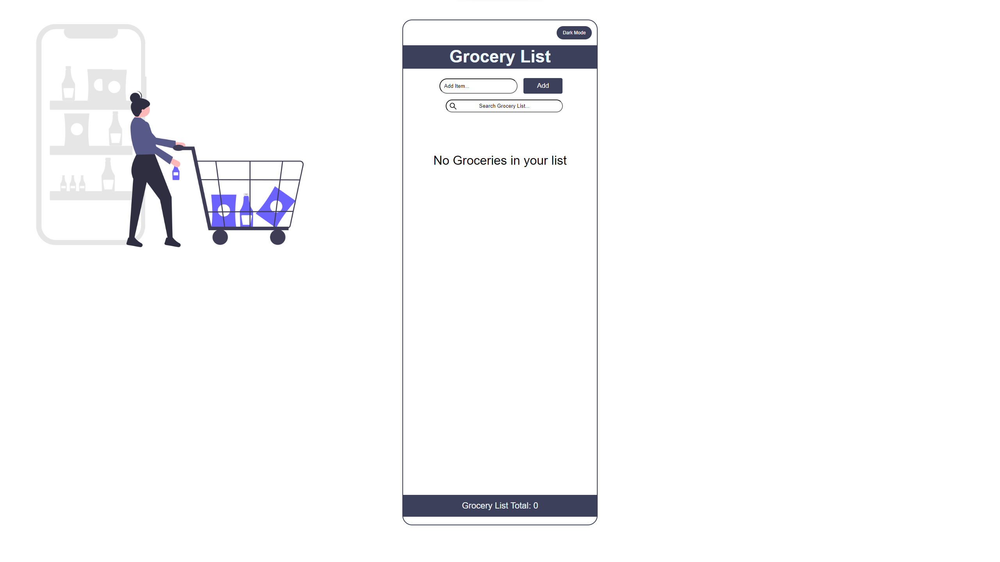

# grocery-list# Project Title

Grocery List

## Demo link:

<!-- Access my site at [google.com](https://google.com) -->

## About The App

[Grocery List] is a mobile responsive grocery list app allows the user to add a grocery item to a list once the item is added it saved into local storage and and be edited or deleted. There is a total count of list items showing at the bottom to keep track and are also able to use the filter input to search for a specific item. This app also has dark mode.

## Screenshots

## Technologies

&nbsp;
&nbsp;
&nbsp;
&nbsp;

## Approach

Built with React and styled with CSS.
